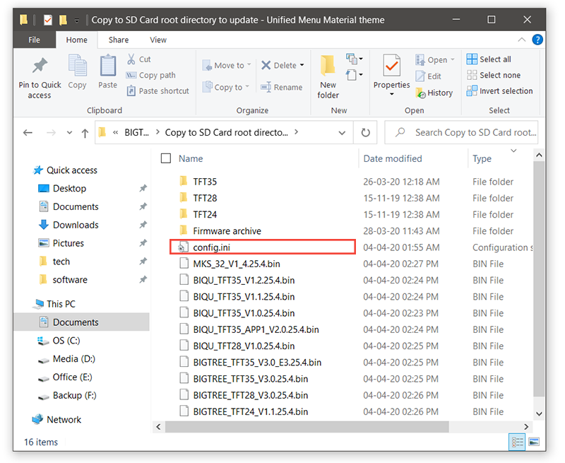
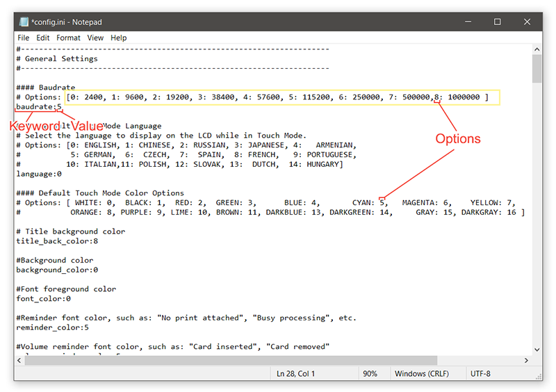
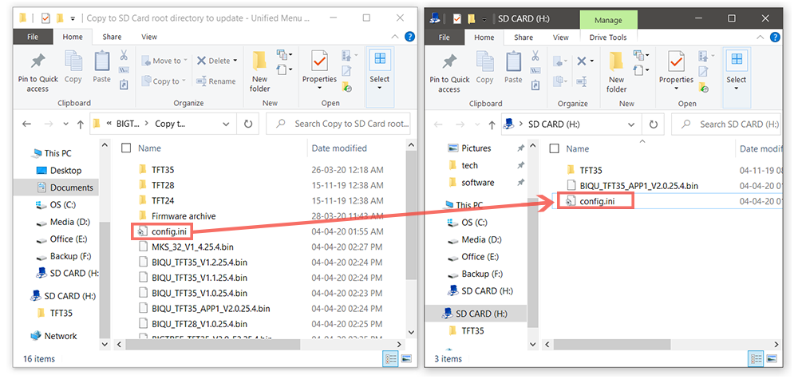

## Configuration du firmware à l'aide du fichier **config.ini**

**Le firmware TFT peut être configuré avec le fichier **config.ini** sans avoir besoin de recompiler le firmware.**


### Modification du fichier **config.ini** :

Avant de modifier le fichier config.ini, veuillez lire les points suivants :
   - Tous les mots-clés des paramètres sont en petites majuscules (a-z) suivis du signe deux-points ' : '.
   - Si un mot-clé a des valeurs non valides, il sera ignoré par le contrôleur TFT et le mot-clé avec des valeurs non valides sera affiché à l'écran pendant la mise à jour.
   - Tout texte après le signe de hachage ' # ' ne sera pas lu par le contrôleur TFT et il passera à la ligne suivante.
   - Il ne devrait y avoir qu'un seul mot-clé par ligne. S'il y a plus d'un mot-clé dans une ligne, seul le premier sera lu par le TFT.
   - Les valeurs du mot-clé doivent commencer après le signe deux-points ' : '.
   - Toutes les chaînes G-Code doivent être sur une seule ligne.
   - Pour définir un passage à la ligne, utilisez **\n** dans les chaînes G-Code. Le TFT convertira le **\n** en passage à la ligne lors de la mise à jour. Par exemple :
     ```
     start_gcode:G28\nG29\nG1 X10 Y10 Z10\n
     ```

### Instructions :
1. Ouvrez le fichier **config.ini** dans n'importe quel éditeur de texte comme Notepad ou Notepad ++.
    


2. Modifiez les valeurs des paramètres de configuration en fonction des options fournies dans le fichier **config.ini**.
    


3. Ignorez les mots clés qui ne sont pas pris en charge par votre version d'écran. Tous les mots-clés de paramètres non pris en charge sont ignorés par le TFT.


4. Enregistrez le fichier **config.ini**. Ne modifiez pas le nom du fichier.


5.  Copiez le fichier **config.ini** à la racine de la carte SD. (La capacité de la carte SD doit être inférieure ou égale à 8 Go et formatée en FAT32)
   


6. Insérez la carte SD dans le port SD du TFT et redémarrez le TFT en appuyant sur le bouton de réinitialisation ou en redémarrant votre imprimante.


7. Le TFT mettra à jour et stockera la configuration à partir du fichier **config.ini**.
